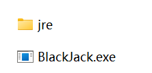

# BlackJack

#### 介绍
用Java写的可以在控制台进行人机对战的21点小游戏，上班摸鱼神器

#### 软件架构
本项目由基础Java语法编写，使用Maven进行打包操作

#### 使用说明

1.本项目采用jre-1.8版本JVM运行

#### 安装说明

1.将jre-1.8版本JVM置于想要进一步打包的格式的（.exe）同一目录下
2.有了jar包后可以使用将jar包变为.exe运行文件的软件（例如exe4j Wizard）进行进一步打包，如图所示：
